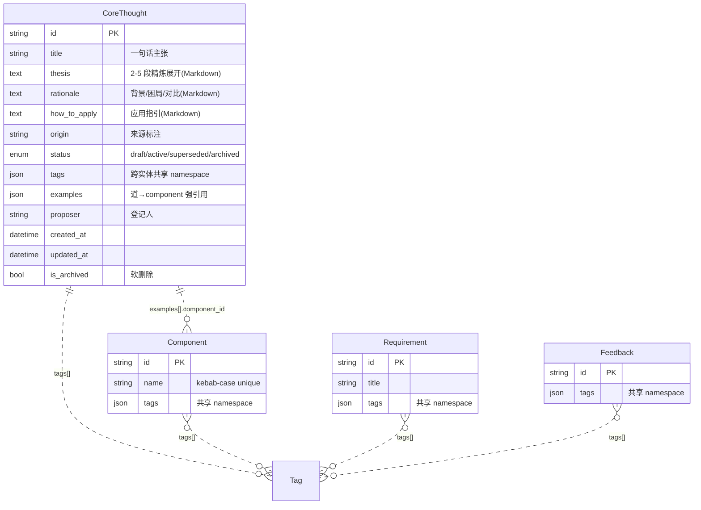

# Design: core_thought(架构平台核心思想实体)

> 配套 ADR: [ADR-0003-core-thought-entity](../../.claude/specs/architecture-decisions/0003-core-thought-entity.md)
> 配套 REQ: REQ-968b1c99(P1 / new_feature)
> 配套 memory: dao-governance-philosophy.md(种子数据源)

## Context

架构平台承载 5 大事务型实体(component / version / feedback / requirement / deployment),全是面向「代码 / 部署 / 反馈」的资产,缺一个面向「原则 / 哲学 / 长期愿景」的资产类型。Q3 治理收尾时总结出治理的「道」——「让人不必记规范也能不犯规范上的错」——目前只在 conversation 和 `memory/dao-governance-philosophy.md` 自由文本里,无法被结构化查询、引用、版本化。

**目标**:新增 `core_thought` 实体作为 arch-platform 第 6 大事务型实体,与现有 5 大同等地位。第一条种子数据从 `memory/dao-governance-philosophy.md` 迁移进来。

## 实体关系图(ER Diagram)



**关系说明**:
- `CoreThought → Component`:`examples[].component_id` JSON 强引用,表达「道在 component X 上的具体应用」
- `CoreThought ↔ Component / Requirement / Feedback`:`tags` 共享 namespace 跨实体弱引用,通过 `?q=tag` 跨实体 search 命中

## 数据模型

### `core_thoughts` 表

| 字段 | 类型 | 必填 | 默认 | 说明 |
|---|---|---|---|---|
| `id` | String(36) PK | 是 | uuid4 | 主键 |
| `title` | String(500) indexed | 是 | — | 一句话主张,如「治理的道:让人不必记规范也能不犯规范上的错」 |
| `thesis` | Text | 是 | — | 2-5 段精炼展开(Markdown) |
| `rationale` | Text | 否 | NULL | 背景/困局/对比(Markdown) |
| `how_to_apply` | Text | 否 | NULL | 应用指引(Markdown) |
| `origin` | String(200) | 否 | NULL | 来源标注,如 `memory/dao-governance-philosophy.md` |
| `status` | Enum(`draft`/`active`/`superseded`/`archived`) | 是 | `draft` | 轻量状态机,**不校验转换矩阵** |
| `tags` | JSON(list[str]) | 是 | `[]` | 跨实体共享 namespace |
| `examples` | JSON(list[{component_id, note}]) | 是 | `[]` | 道 → component 的强引用 + 应用说明 |
| `proposer` | String(100) | 是 | `"api"` | 登记人 |
| `created_at` / `updated_at` | DateTime | 是 | now_utc | updated_at 带 onupdate |
| `is_archived` | Boolean indexed | 是 | False | 软删除,与 status 正交 |

**复合索引**:`(is_archived, status)` 加速 list 默认查询。

## API 设计(7 endpoint)

挂在 `/api/v1/core-thoughts`,tag `core-thoughts`。沿用 Literature 的「公开 GET + API Key 写」模式。

| Method | Path | 鉴权 | 主要参数 | 返回 |
|---|---|---|---|---|
| GET | `/api/v1/core-thoughts` | 公开 | q / tag / status / include_archived / proposer / limit / offset | CoreThoughtList |
| GET | `/api/v1/core-thoughts/{ct_id}` | 公开 | — | CoreThoughtOut |
| POST | `/api/v1/core-thoughts` | API Key | CoreThoughtCreate | 201 + CoreThoughtOut |
| PATCH | `/api/v1/core-thoughts/{ct_id}` | API Key | CoreThoughtUpdate (exclude_unset) | CoreThoughtOut(is_archived=true → 422) |
| DELETE | `/api/v1/core-thoughts/{ct_id}` | API Key | — | `{id, is_archived:true}` |
| POST | `/api/v1/core-thoughts/{ct_id}/restore` | API Key | — | CoreThoughtOut |
| GET | `/api/v1/core-thoughts/by-tag/{tag}` | 公开 | — | CoreThoughtList |

## CLI 设计(6 子命令 + seed-dao-governance)

```
arch core-thought list    --q --tag --status --proposer --include-archived
arch core-thought get     <ct_id>
arch core-thought create  --title --thesis --rationale --how-to-apply --origin \
                          --status --tags "governance,dao" \
                          --examples '[{"component_id":"feedback-cycle","note":"闭环设计的灵魂"}]' \
                          --proposer
arch core-thought update  <ct_id> [--title] [--thesis] ... [--examples '...']
arch core-thought archive <ct_id>
arch core-thought restore <ct_id>
arch core-thought seed-dao-governance    # 幂等 upsert 第一条种子
```

## UI 设计(4 页面 + nav)

模板目录:`backend/app/templates/core_thought/`

- `list.html`:表格(标题 / 标签 chips / 状态 chip / 登记人 / 时间 / examples_count)
- `detail.html`:大标题 + 状态 chip + 标签 chips + thesis / rationale / how_to_apply 分块(复用 `render_markdown`)
- `new.html`:表单(arch-card + label + input/textarea)
- `edit.html`:预填表单(tags CSV 化预填)

**nav 改动**(`templates/base.html`,L37-46):
```html
<a href="/core-thoughts">核心思想</a>
```
在「文献」与「自审」之间插入。

**反向引用**(component detail 页):新增「被 N 条核心思想引用」块,通过 `GET /api/v1/core-thoughts/by-tag/{tag}` 或遍历 active core_thoughts 过滤 `examples[].component_id == self.id`。

## 影响面分析

### 新建表 + 7 endpoint + 6 CLI 子命令 + 4 UI 页面

| 类别 | 行数估计 | 影响 |
|---|---|---|
| 后端 ORM | +25 行(models.py) | 加表 + 加 enum + 加复合索引 |
| 后端 schemas | +60 行(schemas.py) | 6 个 Pydantic schema |
| 后端 routes | +250 行(routes/core_thoughts.py 新建) | 7 个 handler |
| CLI commands | +200 行(commands/core_thought.py 新建) | 6 子命令 + seed-dao-governance |
| CLI client | +60 行(client.py) | 6 个 ArchClient 方法 |
| UI templates | +360 行(4 文件新建) | 4 页面 |
| UI routes | +150 行(ui/routes.py 追加) | 6 路由 + component_detail 反向块 |
| UI helpers | +20 行(helpers.py) | markdown 过滤器 |
| base.html | +1 行(nav) | 加链接 |
| Tests | +600 行(test_z_core_thought.py 新建) | 23 用例 |

**总计**:约 +1730 行代码,改动 5 个文件 + 新建 7 个文件 + 1 个 ADR + 1 个 design doc。

### 不破坏现有组件

- 不改 Component / Requirement / Feedback / Version / Deployment / Literature 表结构
- 不改现有 5 大实体的 API
- 不改现有 UI 模板(只增量添加 component_detail 反向引用块)
- 不改现有 CLI 子命令

### 反向更新 5 个 arch-platform-* 组件 positioning

详见 ADR-0003 决策 6 + Phase 2.4 plan。改动是 `arch component update --positioning` 5 次,纯文本变更,不动 schema。

## 种子数据迁移

种子的字段映射:

| markdown 段落 | core_thought 字段 |
|---|---|
| `# 治理的「道」(2026-06-27)` + 「一句话」+ 「展开」开头一段 | `title` = 「治理的道:让人不必记规范也能不犯规范上的错」 |
| 全文主体(「过去的困局」+「真正的转变」+「背后的道」三块,共 ~40 行 Markdown) | `rationale`(全部细节,含表格 + 列表) |
| 一句话 + 展开开头一段 | `thesis`(精炼展开,2-5 段) |
| 「How to apply」一段 | `how_to_apply`(应用指引) |
| `metadata.originSessionId` + 文件路径 | `origin` = `memory/dao-governance-philosophy.md` |
| author 黄谦敏 | `proposer` = `黄谦敏` |
| 推断 tags | `tags` = `["governance", "dao", "feedback-loop", "audit", "soft-hard-gate"]` |
| 推断 status | `status` = `active`(已被多份后续工作引用) |
| 初版不绑 component | `examples` = `[]`(留待人工事后补充) |

**迁移路径**:CLI 幂等 upsert(`arch core-thought seed-dao-governance`),按 `title` 唯一键去重,可重跑。

## 实施步骤

按 SDLC 8 phase:

1. **Phase 1.f**:REQ-968b1c99 状态推进 triaged — **已完成**
2. **Phase 0**:doubt-driven-development 5 步法 — 详见 ADR-0003 反向论证
3. **Phase 2**:ADR-0003 + 本 design doc + 5 个 component positioning 反向更新
4. **Phase 3**:后端 + CLI + UI 三处并行编码(subagent 派发)
5. **Phase 4**:GH Actions CI(lint + pytest + Trivy)
6. **Phase 5**:23 用例单测 + CLI/seed 冒烟 + 公网 E2E
7. **Phase 6**:git push → GH Actions → smoke test → arch deployment create
8. **Phase 6.5**:`phase-3.1-script-quality-gate` 硬门
9. **Phase 7**:arch 部署地图 + Prometheus/Loki + 备份
10. **Phase 8**:任何 bug 走 `arch feedback create`

## 替代方案(已拒绝)

详见 ADR-0003「替代方案」段:
- (a) 不做新实体 — 拒绝,违背目标
- (b) 新建独立 component — 拒绝,与 Literature 模式不一致
- (c) 复用 Literature 表加 type 字段 — 拒绝,语义混淆
- (d) 加到 Component 表作 core_thought_type 字段 — 拒绝,component 不应承载道层面
- (e) init_db() 自动 seed — 拒绝,违反「种子应由人显式触发」原则
- (f) 8 态强校验状态机 — 拒绝,过度设计

## 关键参考

- 种子源:`memory/dao-governance-philosophy.md`(55 行)
- Literature 模板:`backend/app/routes/literature.py` + `models.py`(Literature ORM)
- Markdown 复用:`backend/app/ui/markdown_renderer.py::render_markdown`
- Drafting Sheet CSS:`static/css/draft.css`
- ADR-0001 / ADR-0002 / CLAUDE.md / SDLC SOP