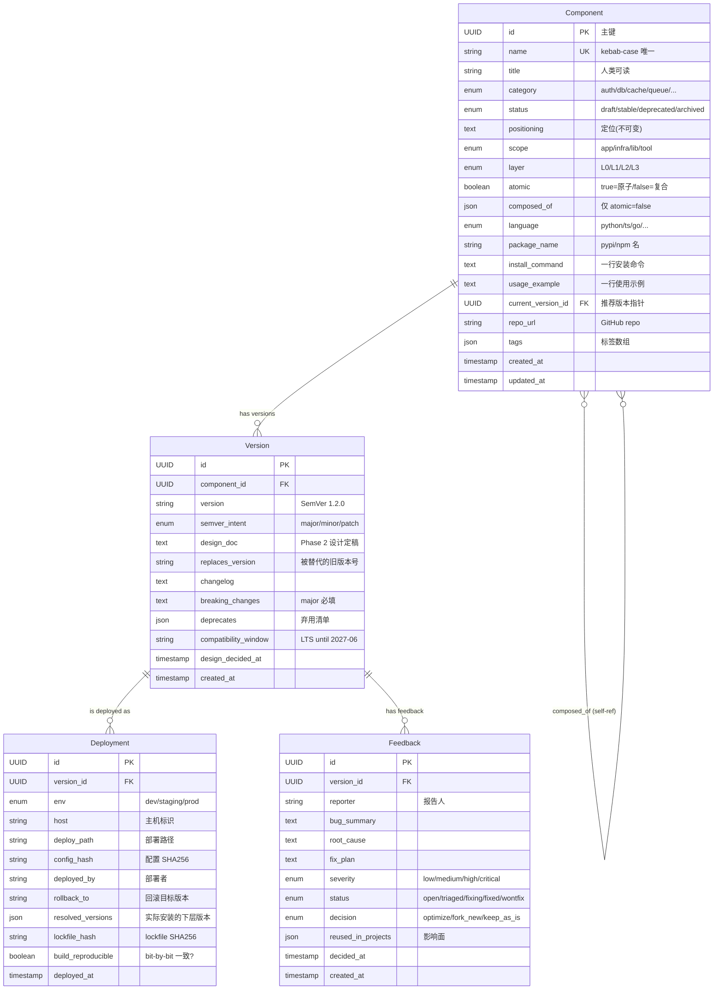
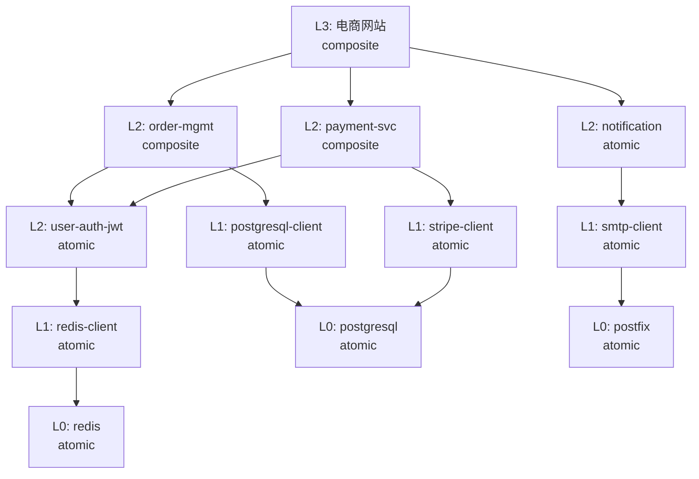

# 架构平台 ER 图

> Phase 0 产物 · 4 个核心实体 + 自引用关系 + 关键约束

## 关系总览

```
Component (1) ──< (N) Version (1) ──< (N) Deployment
   │                                │
   │ 自引用(composed_of)             └──< (N) Feedback
   │  复合组件引原子组件
   └────< (N) Component (composition 边)
```

## Mermaid ER 图



## 7 个关键约束

| # | 约束 | 说明 | 触发拒绝码 |
|---|------|------|----------|
| 1 | **定位稳定性** | `Component.positioning` 不可变,改定位 = 新组件 | — (禁止字段写) |
| 2 | **版本不可变** | Version 记录创建后字段不可改 | — (禁止字段写) |
| 3 | **一组件一当前版本** | `Component.current_version_id` 指针唯一 | — |
| 4 | **反馈必决策** | `status` 转 `fixed`/`wontfix` 前必填 `decision` | `MISSING_DECISION` (422) |
| 5 | **删除软化** | `status = archived` 而非 DELETE | — |
| 6 | **原子性自洽** | `atomic=true` ⇒ `composed_of` 空;反之非空 | `VALIDATION_ERROR` (422) |
| 7 | **复合无环 + 分层一致** | DFS 检测 `composed_of` 图无环;子组件层号 ≤ 自己 | `CYCLE_DETECTED` / `LAYER_INCONSISTENT` (422) |

## 复合组件示例(分层一致 + 无环)



✅ **每条边都向下(L3 → L2 → L1 → L0)**
✅ **无环**
✅ **每个复合组件的子组件层号 ≤ 自己**

## 反向依赖图(Feedback 闭环用)

下层发 major 版 → 架构平台从 `composed_of` **反向**递归查找所有受影响上层:

```
postgresql-client (L1) 升级到 2.0.0 (BREAKING)
  ↓ 反查谁依赖了我
  ↑
  ├── order-mgmt (L2 composite, 1.0.0) — 受影响
  │     ↓ 反查
  │     ↑
  │     └── 电商网站 (L3, 1.0.0) — 受影响
  ├── payment-svc (L2 composite, 0.5.0) — 受影响
  │     ↓ 反查
  │     ↑
  │     └── 电商网站 (L3, 1.0.0) — 二次受影响(去重)
  └── internal-admin (L3, 2.1.0) — 受影响

→ 架构平台自动生成 4 个 "需要决策" 标记
→ 上层 owner 各填 optimize / fork_new / keep_as_is
```

> **应用层缓存**:服务进程内维护 `dict[component_id, set[component_id]]` 反向图,
> 登记/删除/composed_of 变更时增量更新。
> **Phase 1 预留**:SQLite `composition_edges(component_id, child_id, version_constraint)` 表,
> 当前深度 ≤ 5 层 / 总数 ≤ 100 时 JSON 够用,迁移阈值见 DESIGN.md §11.4。